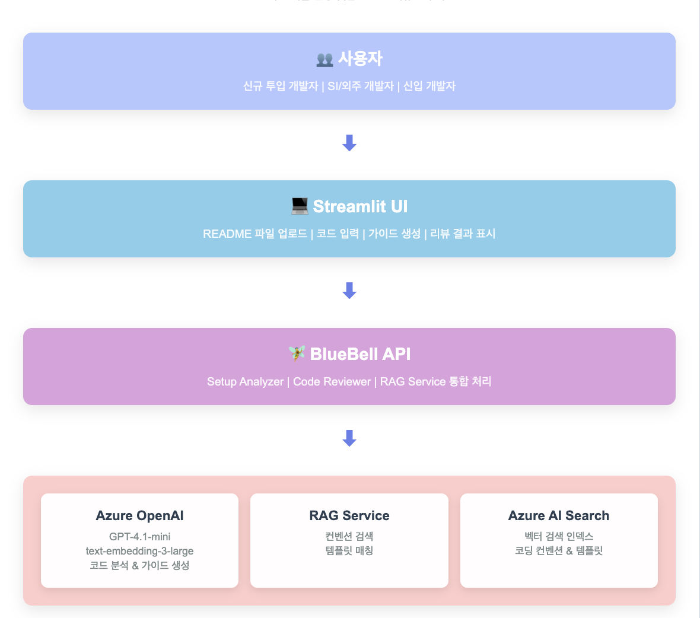

## 🧚‍♂️ BlueBell: 개발 환경 셋업 & 코드 리뷰 도우미

**BlueBell**은 IT 개발자를 위해 설계된 **AI 기반 개발 지원 도구**입니다.  

README 또는 코드 파일을 입력하면,  
1. 프로젝트 메타 정보를 분석해 **OS별 개발 환경 셋업 가이드**를 자동 생성하고,  
2. 사내·고객사 규칙에 맞춘 **코드 스타일 교정 제안**을 제공합니다.

---

### 문제 정의
- 신규 투입 시 프로젝트별 개발 환경 세팅 방식이 제각각 → **초기 생산성 저하**
- 고객사·사내별 코딩 컨벤션 차이로 코드 리뷰·품질 관리 비용 증가
- 신입 개발자는 “무엇을, 어떻게 맞춰야 하는지” 감을 잡기 어려움

---

### 타겟 사용자
- **프로젝트 신규 투입 개발자**: 빠른 환경 적응이 필요한 개발자
- **SI/외주 개발자**: 다양한 클라이언트 프로젝트 개발자
- **신입 개발자**: 프로젝트 파악과 코딩 학습이 필요한 개발자

---

### 핵심 기능

#### 1) AI 기반 개발 환경 셋업 가이드
   - README 및 텍스트 파일 업로드
   - OS별 기본 설치 명령어 자동 추출
   - 프로젝트 실행 방법 초안 생성

#### 2) 사내·고객사 코드 스타일 교정
- 코드 붙여넣기 또는 파일 업로드 → 네이밍, 주석 톤, 로그 레벨, 에러 처리 방식을 규칙에 맞게 제안
- 잘못된 들여쓰기, 네이밍 규칙 위반 간단 지적
- 수정 제안(추천 코드) 표시

---

### 아키텍처

---

### 기술 스택
- Azure 인프라
   - Azure OpenAI Service: GPT-4.1-mini 모델 사용
   - Azure AI Search: 벡터 검색 인덱스 (코딩 컨벤션, 환경 설정 템플릿)
   - Azure Web App: 배포 환경
- Python: 서버 로직, Azure SDK 사용
- Streamlit: 웹 프론트엔드
- RAG Pipeline: 검색 증강 생성 시스템

---

### 설치 및 실행

---

### 기술 구현 세부사항
- RAG 서비스 아키텍처
   - 패턴 추출: 코드를 분석하여 리뷰 관련 패턴 식별 (function_naming, class_naming 등)
   - 관련 검색: 추출된 패턴을 사용하여 코딩 컨벤션 데이터베이스 검색
   - 프롬프트 증강: 컨벤션 정보를 포함한 향상된 리뷰 프롬프트 생성
   - AI 생성: Azure OpenAI를 사용하여 개선된 응답 생성

- 벡터 검색 구현
   - 인덱스 스키마: 코딩 컨벤션과 설정 템플릿용 별도 인덱스
   - 검색 알고리즘: 효율적인 벡터 검색을 위한 HNSW (Hierarchical Navigable Small World)
   - 임베딩 모델: 1536차원의 text-embedding-ada-002
   - 검색 전략: 키워드와 시맨틱 검색을 결합한 하이브리드 검색

---
### 배포
**Azure Web App 배포**
