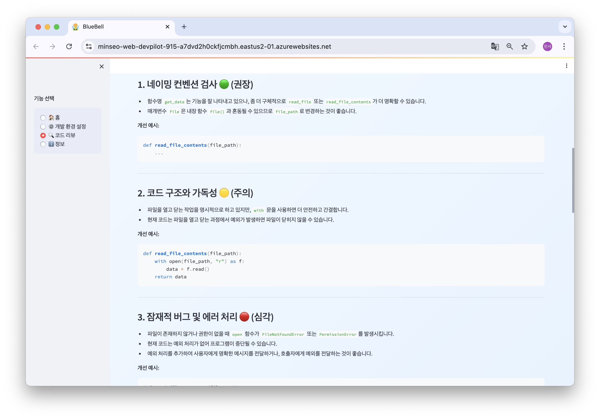

## 🧚‍♂️ BlueBell: 개발 환경 셋업 & 코드 리뷰 도우미

**BlueBell**은 IT 개발자를 위해 설계된 **AI 기반 개발 지원 도구**입니다.

README 또는 코드 파일을 입력하면,  
1. 프로젝트 메타 정보를 분석해 **OS별 개발 환경 셋업 가이드**를 자동 생성하고,  
2. 사내·고객사 규칙에 맞춘 **코드 스타일 교정 제안**을 제공합니다.

---
### 🎯 프로젝트 개요
---

#### 문제 정의
- 신규 투입 시 생산성 저하 : 프로젝트별 개발 환경 세팅 방식이 제각각
- 코드 품질 관리 비용 : 고객사·사내별 코딩 컨벤션 차이로 코드 리뷰·품질 관리 비용 증가
- 학습 문제 : 신입 개발자는 “무엇을, 어떻게 맞춰야 하는지” 감을 잡기 어려움

---

#### 타겟 사용자
- **프로젝트 신규 투입 개발자**: 빠른 환경 적응이 필요한 개발자
- **SI/외주 개발자**: 다양한 클라이언트 프로젝트 개발자
- **신입 개발자**: 프로젝트 파악과 코딩 학습이 필요한 개발자

---

### ✨ 핵심 기능

---

#### 1) AI 기반 개발 환경 셋업 가이드
   - README 및 텍스트 파일 업로드
   - OS별 기본 설치 명령어 자동 생성
   - 프로젝트 실행 방법 초안 생성
<div style="display: flex; justify-content: center;">
  
  
</div>

#### 2) 사내·고객사 코드 스타일 교정
   - 네이밍 컨벤션 검사 : 함수명, 변수명, 클래스명 규칙 검증
   - 코드 구조 분석 : 가독성, 모듈화, 설계 패턴 제안
   - 품질 향상 제안 : 잠재적 버그, 성능 최적화, 보안 취약점 지적
   - 실시간 피드백 : 즉시 개선 코드와 설명 제공
<div style="display: flex; justify-content: center;">
  
  
</div>

---
### ⚙️ 시스템 아키텍처
---


---

### ⚒️ 기술 스택
---
- Azure OpenAI Service
   - LLM: GPT-4.1-mini (코드 분석 및 가이드 생성)
   - Embedding: text-embedding-3-large (벡터 임베딩 생성)
- Azure AI Search: 벡터 검색 인덱스 (코딩 컨벤션, 환경 설정 템플릿)
- Azure Web App: 서비스 배포 및 운영 환경
- Backend: Python 3.11+ (Azure SDK, FastAPI)
- Frontend: Streamlit (웹 UI)
- AI Pipeline: RAG (Retrieval-Augmented Generation)
- Database: Azure AI Search Vector Index

---

### 🔬 기술 구현 세부사항

---
#### 1. 패턴 추출 및 분석
```python
# 코드에서 리뷰 관련 패턴 식별
patterns = extract_code_patterns(code, language)
# 예: function_naming, class_naming, import_style, error_handling
```

#### 2. 관련 컨벤션 검색
```python
# 추출된 패턴으로 관련 컨벤션 검색
conventions = search_client.search_conventions(
    query=patterns_to_query(patterns),
    language=language,
    top=3
)
```

#### 3. 프롬프트 증강
```python
# 검색된 컨벤션을 포함한 향상된 프롬프트 생성
enhanced_prompt = create_enhanced_review_prompt(
    code, language, conventions
)
```

#### 4. AI 응답 생성
```python
# Azure OpenAI로 개선된 응답 생성
review_result = azure_client.get_completion(
    enhanced_prompt, temperature=0.3
)
```

### 데이터 소스

#### 코딩 컨벤션 데이터
- **Python**: PEP 8 기반 네이밍, Import 스타일, 에러 처리
- **JavaScript**: camelCase, 모듈 시스템, 비동기 패턴
- **일반**: 로깅 레벨, 주석 스타일, 보안 가이드라인

#### 환경 설정 템플릿
- **React + TypeScript**: Node.js 설정, 의존성 관리, 빌드 도구
- **Python FastAPI**: 가상환경, Docker, 의존성 설치
- **Java Spring**: Maven/Gradle, JDK 설정, 애플리케이션 서버

### 벡터 검색 구현

#### 인덱스 스키마
```python
# 코딩 컨벤션 인덱스
conventions_schema = {
    "id": "String",
    "title": "Searchable String", 
    "content": "Searchable String",
    "language": "Filterable String",
    "category": "Filterable String",
    "content_vector": "Vector(1536)"  # text-embedding-3-large
}

# 환경 설정 템플릿 인덱스
templates_schema = {
    "id": "String",
    "title": "Searchable String",
    "content": "Searchable String", 
    "tech_stack": "Filterable Collection",
    "os_support": "Filterable Collection",
    "content_vector": "Vector(1536)"
}
```

#### 검색 전략
- **하이브리드 검색**: 키워드 검색 + 시맨틱 벡터 검색 결합
- **필터링**: 언어, 기술스택, OS별 정확한 매칭
- **스코어링**: 관련성 점수 기반 상위 결과 반환

### 성능 및 정확도 향상

#### 임베딩 최적화
- **모델**: `text-embedding-3-large` (1536차원)
- **청킹**: 문서를 의미 단위로 분할하여 정확도 향상
- **캐싱**: 자주 사용되는 임베딩 결과 캐시 처리

#### 프롬프트 엔지니어링
- **컨텍스트 제한**: 토큰 한계 내에서 최적의 정보 선별
- **구조화된 출력**: 일관된 형식의 리뷰 결과 생성
- **단계별 추론**: CoT(Chain of Thought) 방식 적용


---

### 🌐 배포

---
#### Azure Web App 배포

**배포 URL**: [🧚‍♂️ BlueBell](https://minseo-web-devpilot-915-a7dvd2h0ckfjcmbh.eastus2-01.azurewebsites.net/) 

### 배포 과정
1. **Azure Web App 생성**: Python 3.11 런타임 설정
2. **환경변수 구성**: Azure Portal에서 앱 설정에 환경변수 추가
3. **VSCode Azure App Service**: VSCode 확장을 통한 배포

---

### 🔄 향후 개선 및 확장 계획

- **LangChain Agent 도입** : 복잡한 코드 분석을 위한 다단계 추론 및 도구 체인 구성
- **파인튜닝 모델 개발** : 실제 사내 코딩 컨벤션 데이터로 모델을 훈련하여 정확도 90% 이상 향상
- **멀티모달 RAG** : 다이어그램, 문서 이미지까지 분석하는 검색 시스템

---
